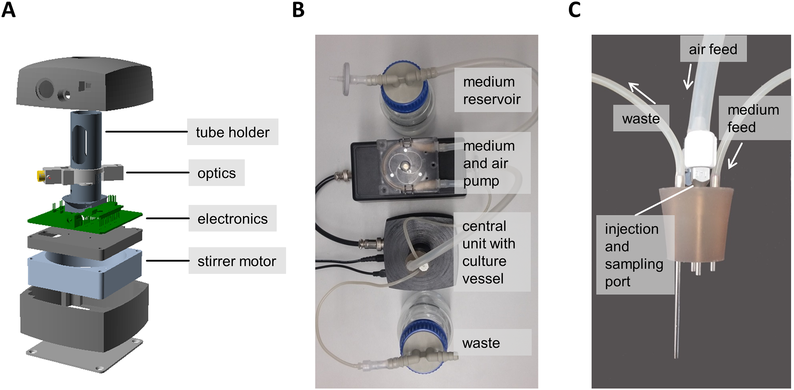
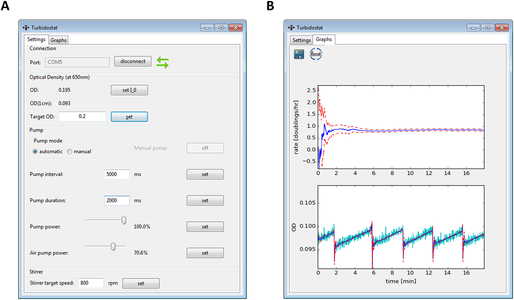

# Turbidostat
Turbidostat bioreactor for microbiology experiments featuring growthrate estimation

[A user-friendly, low-cost turbidostat with versatile growth rate estimation based on an extended Kalman filter](https://journals.plos.org/plosone/article?id=10.1371/journal.pone.0181923)

